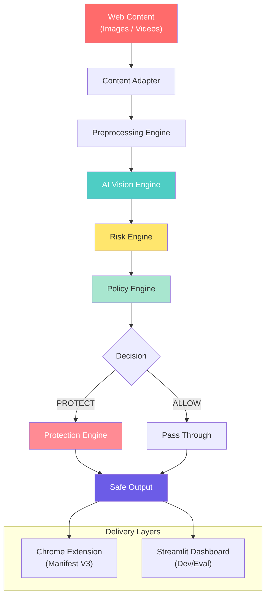
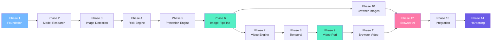

# MyKid — Overall Architecture & Phased Implementation Plan

> This document defines the end-to-end architecture and the phased execution strategy for the MyKid AI Visual Safety System. Each phase will receive a customised implementation plan before execution begins. We confirm the plan, implement it, then move to the next phase.

---

## System Architecture Overview



---

## Technology Stack

| Layer | Development (Python) | Production (Browser) |
|---|---|---|
| **AI Models** | YOLO, OpenCV, ONNX Runtime | ONNX Runtime Web, TF.js, WebGPU |
| **Image Processing** | OpenCV, Pillow | Canvas API, OffscreenCanvas |
| **Video Processing** | OpenCV, FFmpeg | MediaStream, Canvas, Web Workers |
| **UI/Evaluation** | Streamlit | Chrome Extension (Manifest V3) |
| **Configuration** | YAML / .env | Extension storage / JSON |
| **Testing** | pytest, unittest | Jest, Playwright |

---

## Project Directory Structure

```text
MyKidExtension/
├── .agents/
│   └── skills/
│       └── mykid/
│           └── SKILL.md                  ← Authoritative instruction file
│
├── docs/
│   ├── 00-project-overview.md
│   ├── 01-scope.md
│   ├── 02-system-architecture.md
│   ├── 03-development-phases.md
│   ├── 04-image-pipeline.md
│   ├── 05-video-pipeline.md
│   ├── 06-ai-detection.md
│   ├── 07-blurring-engine.md
│   ├── 08-chrome-extension.md
│   ├── 09-testing-evaluation.md
│   └── 10-implementation-rules.md
│
├── apps/
│   ├── extension/                        ← Chrome Manifest V3 Extension
│   │   ├── manifest.json
│   │   ├── src/
│   │   │   ├── background/
│   │   │   ├── content/
│   │   │   ├── offscreen/
│   │   │   └── popup/
│   │   └── assets/
│   └── dashboard/                        ← Streamlit evaluation UI
│       └── app.py
│
├── packages/
│   ├── vision/                           ← AI model abstraction
│   │   ├── models/
│   │   ├── base_model.py
│   │   ├── yolo_model.py
│   │   └── onnx_model.py
│   ├── risk/                             ← Risk assessment engine
│   │   ├── risk_engine.py
│   │   └── risk_config.yaml
│   ├── protection/                       ← Blur / pixelate / cover
│   │   ├── blur_engine.py
│   │   └── protection_modes.py
│   ├── image-processing/                 ← Image pipeline
│   │   ├── loader.py
│   │   ├── preprocessor.py
│   │   └── pipeline.py
│   ├── video-processing/                 ← Video pipeline
│   │   ├── video_loader.py
│   │   ├── frame_sampler.py
│   │   ├── temporal_tracker.py
│   │   └── pipeline.py
│   └── shared/                           ← Shared types, config, logging
│       ├── types.py
│       ├── config.py
│       ├── logger.py
│       └── errors.py
│
├── models/                               ← Model weights & ONNX exports
│
├── tests/
│   ├── unit/
│   ├── integration/
│   ├── image/
│   ├── video/
│   └── browser/
│
├── test-data/
│   ├── images/
│   │   ├── safe/
│   │   └── harmful/
│   └── videos/
│       ├── safe/
│       └── harmful/
│
├── scripts/                              ← Utility & benchmark scripts
│
├── configs/
│   ├── default.yaml
│   └── thresholds.yaml
│
├── README.md
└── requirements.txt
```

---

## Phased Execution Plan

Each phase below will be expanded into a **custom implementation plan** before work begins. The workflow for each phase is:

```text
1. Create customised plan for the phase
2. Present plan for user review & confirmation
3. Implement the phase
4. Test & verify
5. Document results
6. Move to next phase
```

---

### Phase 1 — Repository Foundation
**Goal**: Establish project skeleton, configuration system, shared types, logging, error handling, and test infrastructure.

| Item | Description |
|---|---|
| **Deliverables** | Directory structure, `shared/` package (types, config, logger, errors), base test setup, README |
| **Dependencies** | None |
| **Verification** | All imports resolve, tests pass, config loads correctly |
| **Status** | ⬜ Not Started |

---

### Phase 2 — AI Model Research & Selection
**Goal**: Evaluate candidate AI models for object detection and scene classification. Select a baseline model with evidence.

| Item | Description |
|---|---|
| **Deliverables** | Model comparison document, benchmark results, selected model with justification |
| **Candidates** | YOLOv8/v11, YOLO-NAS, ONNX models, safety-specific classifiers |
| **Criteria** | Accuracy, speed, size, browser compatibility, license, supported classes |
| **Verification** | Model loads and produces detections on test images |
| **Status** | ⬜ Not Started |

---

### Phase 3 — Image Detection Engine
**Goal**: Implement image loading, preprocessing, and AI inference to produce structured detections.

| Item | Description |
|---|---|
| **Deliverables** | `vision/` package with model abstraction, `image-processing/` loader & preprocessor |
| **Input** | Image file (JPG, PNG, WebP) |
| **Output** | Structured detection JSON (labels, confidence, bounding boxes) |
| **Verification** | Detections on safe and harmful test images are accurate and structured |
| **Status** | ⬜ Not Started |

---

### Phase 4 — Image Risk Engine
**Goal**: Convert raw detections into contextual risk assessments.

| Item | Description |
|---|---|
| **Deliverables** | `risk/` package with configurable risk rules and thresholds |
| **Input** | Detection results |
| **Output** | Risk level (LOW / MEDIUM / HIGH) + recommended action |
| **Verification** | Knife-in-cooking → LOW, knife-in-violence → HIGH |
| **Status** | ⬜ Not Started |

---

### Phase 5 — Image Protection Engine
**Goal**: Apply visual protection (blur, pixelate, cover) to harmful regions or entire images.

| Item | Description |
|---|---|
| **Deliverables** | `protection/` package with Gaussian blur, pixelation, cover modes |
| **Input** | Image + protected regions + protection type |
| **Output** | Protected image |
| **Verification** | Correct region blurred with padding, full-frame blur works |
| **Status** | ⬜ Not Started |

---

### Phase 6 — End-to-End Image Pipeline
**Goal**: Connect detection → risk → protection into a complete, tested image pipeline.

| Item | Description |
|---|---|
| **Deliverables** | `image-processing/pipeline.py`, end-to-end test suite, Streamlit demo |
| **Input** | Any supported image |
| **Output** | Protected image + detection metadata |
| **Verification** | Full test suite passes, Streamlit demo shows before/after |
| **Status** | ⬜ Not Started |

---

### Phase 7 — Video Engine
**Goal**: Implement video loading, frame extraction, sampling, detection, and protection.

| Item | Description |
|---|---|
| **Deliverables** | `video-processing/` package with loader, frame sampler, pipeline |
| **Input** | Video file (MP4, WebM) |
| **Output** | Protected video file |
| **Verification** | Output video is playable, harmful frames are protected |
| **Status** | ⬜ Not Started |

---

### Phase 8 — Temporal Consistency
**Goal**: Eliminate detection flickering in video through tracking and state management.

| Item | Description |
|---|---|
| **Deliverables** | `video-processing/temporal_tracker.py`, confidence smoothing, persistence logic |
| **Input** | Sequence of frame detections |
| **Output** | Stable protection decisions across frames |
| **Verification** | No visible flickering, smooth protection transitions |
| **Status** | ⬜ Not Started |

---

### Phase 9 — Video Quality & Performance
**Goal**: Optimize video processing for speed, memory, and output quality.

| Item | Description |
|---|---|
| **Deliverables** | Performance benchmarks, optimized inference frequency, memory profiling |
| **Metrics** | FPS, latency, memory usage, CPU/GPU utilization |
| **Verification** | Before/after benchmarks show measurable improvement |
| **Status** | ⬜ Not Started |

---

### Phase 10 — Browser Image Protection
**Goal**: Build Chrome Extension (Manifest V3) that discovers and protects images on web pages.

| Item | Description |
|---|---|
| **Deliverables** | `apps/extension/` with manifest, content script, image discovery, MutationObserver |
| **Capabilities** | Discover `` elements, handle dynamic loading, apply protection |
| **Verification** | Extension installs, discovers images, protects harmful content |
| **Status** | ⬜ Not Started |

---

### Phase 11 — Browser Video Protection
**Goal**: Extend the Chrome Extension to handle HTML5 `<video>` elements.

| Item | Description |
|---|---|
| **Deliverables** | Video detection in content script, frame capture, protection overlay |
| **Capabilities** | Discover `<video>`, sample frames, apply overlay protection |
| **Verification** | Videos are protected without replacing the element |
| **Status** | ⬜ Not Started |

---

### Phase 12 — Browser AI Deployment
**Goal**: Deploy AI model to run in-browser using ONNX Runtime Web, TF.js, or WebGPU.

| Item | Description |
|---|---|
| **Deliverables** | Exported model, browser inference engine, Web Worker integration |
| **Candidates** | ONNX Runtime Web, TensorFlow.js, WebGPU |
| **Verification** | Model runs in browser, inference latency is acceptable |
| **Status** | ⬜ Not Started |

---

### Phase 13 — Full Integration
**Goal**: Validate that the complete system works end-to-end across both reference and browser pipelines.

| Item | Description |
|---|---|
| **Deliverables** | Integration test suite, cross-pipeline consistency validation |
| **Verification** | Same safety decisions in Python and browser for identical inputs |
| **Status** | ⬜ Not Started |

---

### Phase 14 — Testing & Hardening
**Goal**: Comprehensive testing, performance validation, privacy review, and documentation finalization.

| Item | Description |
|---|---|
| **Deliverables** | Full test results, performance report, privacy audit, final documentation |
| **Coverage** | Regression, browser, model, performance, failure, privacy |
| **Verification** | All critical tests pass, documentation is complete and accurate |
| **Status** | ⬜ Not Started |

---

## Phase Dependency Graph



---

## Execution Protocol

For **every phase**, the following protocol applies:

1. **Plan** — I create a detailed implementation plan for the specific phase
2. **Confirm** — You review and approve the plan
3. **Implement** — I execute the plan incrementally
4. **Test** — I verify all deliverables work correctly
5. **Document** — I update docs and report what changed
6. **Advance** — We move to the next phase

> **We do NOT skip phases. We do NOT implement without a confirmed plan.**

---

## Current Status

| Phase | Status | Notes |
|---|---|---|
| Phase 1 — Foundation | ⬜ Not Started | **Next up** |
| Phase 2 — Model Research | ⬜ Not Started | |
| Phase 3 — Image Detection | ⬜ Not Started | |
| Phase 4 — Risk Engine | ⬜ Not Started | |
| Phase 5 — Protection Engine | ⬜ Not Started | |
| Phase 6 — Image Pipeline | ⬜ Not Started | |
| Phase 7 — Video Engine | ⬜ Not Started | |
| Phase 8 — Temporal | ⬜ Not Started | |
| Phase 9 — Video Perf | ⬜ Not Started | |
| Phase 10 — Browser Images | ⬜ Not Started | |
| Phase 11 — Browser Video | ⬜ Not Started | |
| Phase 12 — Browser AI | ⬜ Not Started | |
| Phase 13 — Integration | ⬜ Not Started | |
| Phase 14 — Hardening | ⬜ Not Started | |
